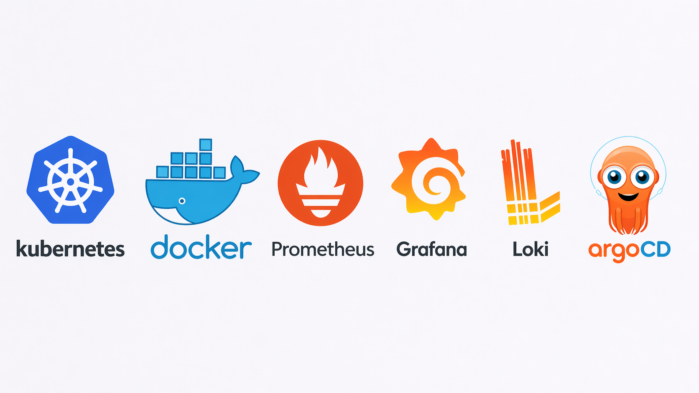
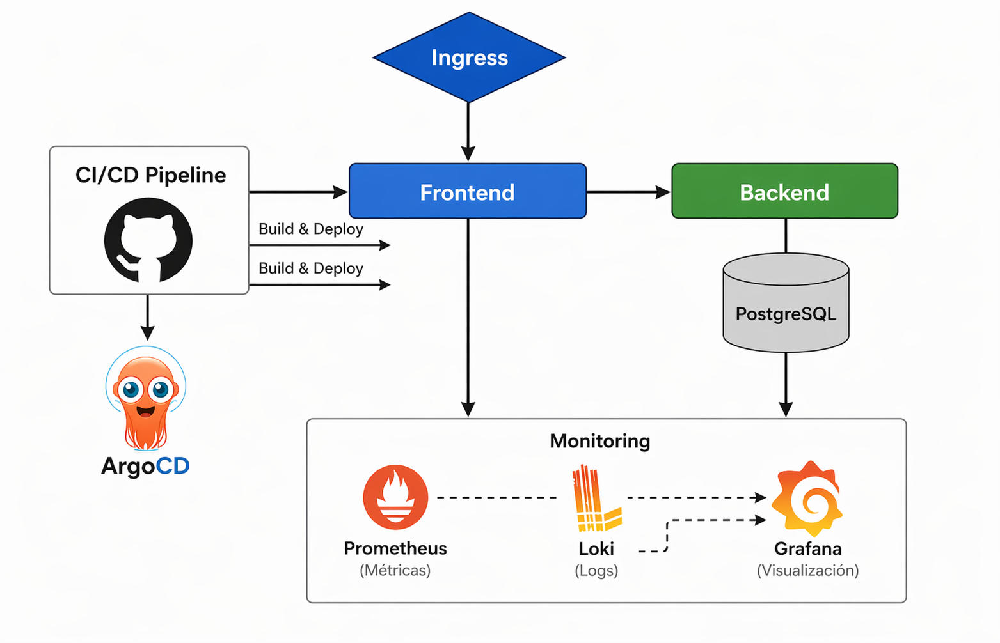

# wellness-ops

[](https://github.com/luisrodvilladaorg/wellness-ops/actions/workflows/ci.yml)
[](https://github.com/luisrodvilladaorg/wellness-ops/actions/workflows/cd-dev.yml)
[](https://github.com/luisrodvilladaorg/wellness-ops/actions/workflows/cd-staging.yml)
[](https://github.com/luisrodvilladaorg/wellness-gitops/actions/workflows/cd.yml)
[](https://github.com/luisrodvilladaorg/wellness-ops/commits/main)
[](LICENSE)

# Production-grade Kubernetes platform — GitOps, CI/CD, TLS, and observability on k3s.

## Platform Overview



## TL;DR

- **Stack**: Node.js backend + frontend + PostgreSQL on Kubernetes (k3s).
- **CI/CD**: GitHub Actions builds and pushes images to GHCR on every commit.
- **GitOps**: ArgoCD syncs desired state from [`wellness-gitops`](https://github.com/luisrodvilladaorg/wellness-gitops).
- **Environments**: `dev`, `staging`, and `prod` via Kustomize overlays.
- **Ingress**: NGINX Ingress Controller + TLS via `cert-manager`.
- **Observability**: Prometheus + Grafana via `ServiceMonitor`.
- **Security**: SealedSecrets, Trivy image scanning, Cosign image signing.
- **Promotion flow**: `main` -> `dev`, release-candidate tags (`v*.*.*-rc.*`) -> `staging`, and release tags (`v*.*.*`) -> `prod`.

## Architecture (current)



## ArgoCD


## Running Pods


## Dev Namespace


## Observability

Backend metrics exposed via `ServiceMonitor` and scraped by Prometheus.
Grafana dashboards provide real-time visibility into cluster and application health.


## CI/CD Pipeline

1. Pull request to `main` -> `ci.yml` executes lint, tests, build, and Trivy quality gate.
2. Push to `main` -> `cd-dev.yml` builds backend/frontend images, scans with Trivy, pushes to GHCR, and updates `dev` overlays in `wellness-gitops`.
3. Tag `v*.*.*-rc.*` -> `cd-staging.yml` builds/scans/pushes images and updates `staging` overlays in `wellness-gitops`.
4. Tag `v*.*.*` -> production promotion workflow updates `prod` overlays in `wellness-gitops`.
5. ArgoCD detects GitOps changes and syncs each environment automatically.


## External Access

HTTP(S) routing via NGINX Ingress Controller — `/api` → `backend-service`, `/` → `frontend-service`.


## Repository Model

- `wellness-ops`: application code, Dockerfiles, runtime configs, and operational docs.
- `wellness-gitops`: Kubernetes desired state (base + overlays) synchronized by ArgoCD.

## Infrastructure & GitOps

Application code and deployment state are fully separated across two repositories:

- [`wellness-ops`](https://github.com/luisrodvilladaorg/wellness-ops): app code, Dockerfiles, workflows, and docs.
- [`wellness-gitops`](https://github.com/luisrodvilladaorg/wellness-gitops): Kubernetes desired state (base + overlays) synced by ArgoCD.

CI pushes new image tags to `wellness-gitops` - ArgoCD handles the rest.

## Production Environment

Production environment with the promoted release and stable runtime configuration.


> TODO: add updated production screenshot (April 2026 pipelines).

## Staging Environment

Pre-production environment for release-candidate validation (`v*.*.*-rc.*`).

> TODO: add staging screenshot (pods + ArgoCD app sync).

## Dev Environment

Development environment focused on validation and fast iteration before production promotion.


## Evidence Board (Pending Captures)

This section is intentionally prepared to publish updates incrementally.

- DEV capture pending: ArgoCD + pods + ingress response.
- STAGING capture pending: ArgoCD + pods + release-candidate image tag.
- PROD capture pending: ArgoCD + pods + stable version tag.

## What this project does today

- Builds frontend/backend images and publishes them to GHCR.
- Updates image tags in `wellness-gitops` via GitHub Actions.
- ArgoCD synchronizes desired state from Git to the cluster.
- HTTP(S) routing through NGINX Ingress:
  - `/api` -> `backend-service`
  - `/` -> `frontend-service`

### Internal Security: Backend <-> PostgreSQL

Backend-to-PostgreSQL traffic is handled through internal Kubernetes Services (`backend-service` and `postgres-service`) and is encrypted in transit with SSL/TLS.
PostgreSQL is configured with `ssl=on` and the backend connects using SSL (`ssl: { rejectUnauthorized: false }` for a self-signed certificate setup).
Operational validation confirmed active encrypted sessions (`TLSv1.3` with `AES-256-GCM`), while PostgreSQL remains private with no direct external exposure.

## Security

- **TLS in transit**: PostgreSQL configured with `ssl=on`, backend connects via TLS 1.3 + AES-256-GCM.
- **Secrets management**: SealedSecrets — secrets encrypted at rest, safe to commit to Git.
- **Image scanning**: Trivy scans images on every CI run before pushing to GHCR.
- **Image signing**: Cosign signs images in GHCR for supply chain integrity.

## Project Structure

```text
wellness-ops/
├── backend/                  # Node.js API, tests, Dockerfiles
│   ├── src/
│   └── test/
├── frontend/                 # Frontend app and production/dev Dockerfiles
│   └── mi-web/
├── db/                       # Database bootstrap SQL
│   └── init.sql
├── env/                      # Environment variable files per environment
│   ├── dev/
│   └── prod/
├── k8s/                      # Local reference manifests (non-canonical)
│   ├── backend/
│   ├── frontend/
│   ├── postgres/
│   ├── ingress/
│   ├── monitoring/
│   ├── metallb/
│   └── tls/
├── nginx/                    # NGINX configs and Dockerfiles
├── docs/                     # Runbook, security, deployment flow, architecture images
│   └── images/
├── monitoring-docker/        # Local Prometheus config
├── monitoring-k8s/           # ServiceMonitor manifests for Kubernetes
├── Docker-practica/          # Practice/lab sandbox
├── docker-compose*.yml       # Local and production-style compose stacks
├── Makefile                  # Operational shortcuts
└── README.md
```

## Current status (multi-environment)

Snapshot updated for April 2026 rollout:

- `dev` running and receiving continuous delivery from `main`.
- `staging` running and receiving release-candidate promotions.
- `prod` running with stable promoted releases.

Quick verification commands:

```bash
kubectl get all -n dev
kubectl get all -n staging
kubectl get all -n prod
```

## Quick usage

- Local startup (`dev`):

```bash
git clone https://github.com/luisrodvilladaorg/wellness-ops.git
cd wellness-ops
docker compose -f docker-compose.dev.yml up -d
```

- Kubernetes quick check (`dev`):

```bash
kubectl get all -n dev
```

## Resources

- [docs/RUNBOOK.md](docs/RUNBOOK.md)
- [docs/deployment-flow.md](docs/deployment-flow.md)
- [docs/ingress-controller.md](docs/ingress-controller.md)
- [docs/observability-grafana-prometheus.md](docs/observability-grafana-prometheus.md)
- [docs/SECURITY.md](docs/SECURITY.md)

### Folder guide

- `backend/`: API service, runtime logic, tests, and image build definitions.
- `frontend/`: static/frontend app and containerization config.
- `k8s/`: local reference manifests for practice and validation; canonical cluster desired state lives in `wellness-gitops`.
- `docs/`: operational and architecture documentation.
- `nginx/`: reverse-proxy configuration for container-based environments.
- `monitoring-*`: observability resources split by Docker and Kubernetes contexts.

## License

Project distributed under [LICENSE](LICENSE).

## Author

Luis Fernando Rodríguez Villada  
[LinkedIn](https://www.linkedin.com/in/luis-fernando-rodriguez-villada/?locale=es) · luisfernando198912@gmail.com
