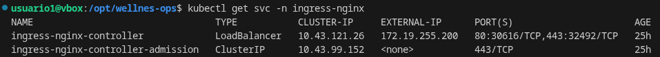
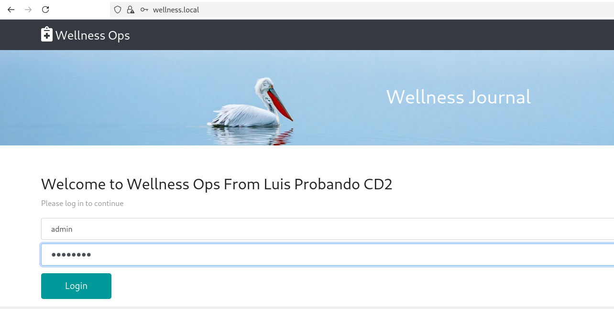

# 🧭 ¿Qué es esto?


Este proyecto es un entorno DevOps completamente containerizado y listo para producción, diseñado para demostrar prácticas modernas de infraestructura. Reúne Docker, Kubernetes, GitHub Actions, NGINX, TLS, monitoreo y pipelines CI/CD completos para mostrar cómo una aplicación del mundo real se construye, se despliega y se opera de manera integral.

## ⚙️ ¿Qué hace?

Este sistema construye y despliega un backend en Node.js, sirve un frontend estático a través de una puerta de enlace NGINX, gestiona el tráfico utilizando un Ingress Controller y expone la aplicación de forma segura a través de TLS. También incluye pipelines de CI/CD automatizados, publicación de imágenes de contenedor, manifiestos de Kubernetes y una pila completa de monitoreo con Prometheus, Grafana (instalado con Helm) y Alertmanager.

 <p align="center">
  
</p>

---

## 🎯 Características principales

- ✅ Backend Node.js con rutas API y autenticación JWT
- ✅ Frontend estático (HTML/CSS/JS) servido a través de NGINX
- ✅ Base de datos PostgreSQL
- ✅ Docker Compose para desarrollo local
- ✅ Manifiestos de Kubernetes para orquestación en producción
- ✅ CI/CD con GitHub Actions (construcción y publicación automática de imágenes)
- ✅ Monitoreo con Prometheus e integración de métricas
- ✅ TLS con certificados válidos (Let's Encrypt en producción, autofirmados en desarrollo)
- ✅ MetalLB para equilibrio de carga en clusters bare-metal
- ✅ NGINX como controlador de ingreso y proxy inverso

---

## 📐 Arquitectura


---

## 🐳 Pods en ejecución


---

## 📊 Monitoreo


---

## 🔄 CI/CD - Integración Continua y Entrega Continua

Este pipeline automatiza completamente el despliegue de los servicios en Kubernetes, garantizando entregas rápidas y seguras.

**Cada vez que se publica una nueva versión o se ejecuta el workflow:**

- 🔧 Se actualiza la imagen del servicio en el clúster
- 🔄 Kubernetes realiza un rolling update sin interrupciones
- ⏳ Se espera a que el despliegue finalice correctamente
- ✅ Se verifica que la aplicación responde correctamente

👉 **Resultado:** Despliegues seguros, automatizados y sin tiempo de inactividad (zero downtime)


---

## 🚀 Integración Continua - Backend

Este proceso valida y compila el código del backend cada vez que se realiza un push o pull request.

**El flujo de integración continua del backend:**

- 🔍 Se ejecutan pruebas unitarias e integración
- 📦 Se construye la imagen Docker del servicio
- 🏗️ Se validan las configuraciones y dependencias
- 📤 Se etiqueta y prepara la imagen para publicar

👉 **Garantía:** Código validado, compilado y listo para ser desplegado en cualquier momento


---

## 📦 Despliegue/Entrega Continua

Automatiza la entrega y despliegue automático de las versiones compiladas en los ambientes correspondientes.

**El proceso de despliegue continuo:**

- 🐳 Se publica la imagen en el registro de contenedores (GHCR)
- 🔐 Se valida la firma y integridad de la imagen
- 📝 Se actualizan los manifiestos de Kubernetes
- 🚀 Se despliega automáticamente en el cluster de producción
- 📊 Se monitorean los logs y métricas post-despliegue

👉 **Beneficio:** Entregas automáticas, auditorables y con historial completo de cambios


---

## 📈 Pipelines

Visualización del estado y progreso de los pipelines CI/CD ejecutándose en GitHub Actions.

**Monitoreo de pipelines:**

- 📊 Estado en tiempo real de compilaciones
- ⏱️ Tiempo de ejecución de cada etapa
- ✅ Logs detallados de cada paso
- 🔄 Historial de ejecuciones y rollbacks
- 📧 Notificaciones automáticas en caso de fallos

👉 **Transparencia:** Visibilidad total del ciclo de vida de cada despliegue


---

## 📉 Prometheus

Sistema de monitoreo y base de datos de series temporales que recopila métricas del backend en tiempo real.

**Funcionalidades de Prometheus:**

- 📊 Recopilación automática de métricas del backend
- 💾 Almacenamiento de series temporales (TSDB)
- 🔍 Consultas avanzadas mediante PromQL
- 🚨 Alertas basadas en reglas personalizadas
- 📈 Retención configurable de datos históricos

👉 **Ventaja:** Datos de monitoreo confiables, durables y consultables para análisis


---

## 📊 Grafana

Plataforma de visualización que transforma los datos de Prometheus en dashboards interactivos y alertas visuales. Instalado en el cluster de Kubernetes mediante Helm.

**Capacidades de Grafana:**

- 📈 Dashboards personalizados en tiempo real
- 🎨 Gráficos interactivos y tablas de datos
- 📲 Alertas visuales y notificaciones
- 👥 Control de acceso basado en roles (RBAC)
- 📊 Análisis de tendencias históricas

👉 **Resultado:** Visibilidad completa del estado y desempeño de la infraestructura en producción


---

## 📌 Métricas

Métricas clave del sistema que proporcionan información sobre el desempeño, disponibilidad y salud de la aplicación.

**Métricas monitoreadas:**

- ⏱️ Latencia de respuestas (p50, p95, p99)
- 📊 Tasa de solicitudes por segundo (RPS)
- ❌ Tasa de errores (5xx, 4xx)
- 💾 Uso de memoria y CPU
- 🔄 Estado de conectividad de base de datos
- 📈 Throughput de transacciones

👉 **Propósito:** Información cuantifiable para tomar decisiones sobre escalabilidad y optimización


---

## 🌍 Entornos

El proyecto soporta dos entornos completamente configurados, cada uno optimizado para su propósito específico.

### 🖥️ Entorno de Desarrollo

Configuración local para desarrollo e integración rápida de cambios.

**Características:**

- 🐳 Docker Compose para orquestación simple
- 🔄 Hot-reload y recarga automática de cambios
- 🐛 Logs detallados y debugging habilitado
- 📝 Base de datos PostgreSQL en contenedor local
- 🔓 Certificados autofirmados (sin HTTPS real)
- ⚡ Stack minimalista y rápido de levantar

**Comando:**
```shell
docker compose -f docker-compose.dev.yml up -d
```

### 🏢 Entorno de Producción

Despliegue en Kubernetes con alta disponibilidad y resiliencia.

**Características:**

- ☸️ Kubernetes con rolling updates (configurado) y auto-scaling (en implementación)
- 🔐 HTTPS con certificados Let's Encrypt válidos (cert-manager + ACME)
- 📊 Monitoreo completo con Prometheus, Grafana (instalado con Helm) y Alertmanager
- 🚀 CI/CD automatizado con GitHub Actions
- 💾 Persistencia de datos con StatefulSets
- 📈 Métricas y alertas en tiempo real
- 🔄 Loadbalancing con MetalLB

**Comando:**
```shell
kubectl apply -R -f k8s/
```

### 📊 Comparativa de Entornos

| Aspecto | Desarrollo | Producción |
|--------|-----------|-----------|
| **Orquestación** | Docker Compose | Kubernetes |
| **Persistencia** | Volúmenes locales | StatefulSets + PVCs |
| **TLS/HTTPS** | Autofirmado | Let's Encrypt (válido) |
| **Monitoreo** | Prometheus + Grafana | Prometheus + Grafana (Helm) + Alertmanager |
| **Escalabilidad** | Manual | Automática (HPA en desarrollo) |
| **Alertas** | No | Alertmanager + Grafana |
| **Tiempo setup** | ~2 minutos | ~5 minutos |

👉 **Síntesis:** Desarrollo para iteración rápida, Producción para confiabilidad y escalabilidad

---

## 📚 Documentación

Para capturas de pantalla adicionales relacionadas con el proyecto y su ejecución, visite el siguiente enlace: [Guía de Kubernetes y Docker - wellness ops](docs/kubernetes-guide.pdf).

---

## 🔀 Flujo de Tráfico

Este proyecto implementa una arquitectura de red moderna y segura que gestiona el tráfico en múltiples capas, desde la entrada del usuario final hasta los servicios backend. Cada capa tiene un propósito específico en la cadena de procesamiento de solicitudes.

### 📍 Arquitectura de Red por Capas

```
┌─────────────────────────────────────────────────────────────┐
│                    🌐 Cliente/Navegador                      │
│              (Usuario accediendo a wellness.local)            │
└────────────────────────┬────────────────────────────────────┘
                         │ HTTPS (Puerto 443)
                         ▼
┌─────────────────────────────────────────────────────────────┐
│         🔐 MetalLB Load Balancer (Capa 3/4)                  │
│     • Asigna IP externa al Ingress Controller                │
│     • Enruta tráfico TCP/UDP a los pods del Ingress         │
│     • Distribuye conexiones entre réplicas                   │
└────────────────────────┬────────────────────────────────────┘
                         │ TCP/443 → IP:443
                         ▼
┌─────────────────────────────────────────────────────────────┐
│      🎛️ NGINX Ingress Controller (Capa 7)                    │
│     • Termina conexiones TLS/SSL                             │
│     • Inspecciona headers HTTP                               │
│     • Enruta basado en hostname/path                         │
│     • Reescribe URLs (URI rewriting)                         │
└──────────────┬────────────────────────────────┬──────────────┘
               │                                │
        /api/* │                                │ /*
               ▼                                ▼
    ┌──────────────────────┐      ┌──────────────────────┐
    │  🟢 Backend Service  │      │ 🟡 Frontend Service  │
    │   (Node.js + Prom)   │      │  (NGINX Static HTML) │
    │  ClusterIP:3000      │      │  ClusterIP:80        │
    └──────────┬───────────┘      └──────────┬───────────┘
               │                             │
               ▼                             ▼
    ┌──────────────────────┐      ┌──────────────────────┐
    │  📊 Backend Pod(s)   │      │ 🖼️ Frontend Pod(s)  │
    │  • Rutas API REST    │      │ • Contenido estático │
    │  • JWT Auth          │      │ • Redirects          │
    │  • Métricas (9090)   │      │ • Cache control      │
    └──────────┬───────────┘      └──────────────────────┘
               │
               ▼
    ┌──────────────────────┐
    │   🗄️ PostgreSQL DB   │
    │   ClusterIP:5432     │
    │   • Persistencia     │
    │   • Transacciones    │
    └──────────────────────┘
```


### Explicación del Flujo de Tráfico

El tráfico ingresa al cluster a través de **MetalLB**, que asigna una dirección IP externa y actúa como punto de entrada. Desde ahí, todas las solicitudes HTTPS (puerto 443) son recibidas por el **NGINX Ingress Controller**, quien:

1. **Termina la conexión TLS/SSL** - Desencripta el tráfico HTTPS
2. **Inspecciona headers HTTP** - Extrae información del hostname y la ruta solicitada
3. **Enruta inteligentemente** - Dirige las solicitudes según rules configuradas:
   - Rutas que comienzan con `/api/*` → Backend Service (ClusterIP:3000)
   - Todas las demás rutas `/*` → Frontend Service (ClusterIP:80)
4. **Propaga la solicitud** - Los servicios internos distribuyen el tráfico a los pods correspondientes

El **Backend** es el único componente autorizado para acceder a **PostgreSQL**, garantizando que la base de datos esté aislada de conexiones externas. Cada capa implementa protecciones específicas: TLS en la capa de transporte, rate limiting en NGINX, autenticación JWT en la API, y aislamiento de red en la base de datos.

### � Seguridad en Capas

| Capa | Mecanismo | Propósito |
|------|-----------|----------|
| **Ingress/TLS** | Certificado Let's Encrypt | Encriptación en tránsito, identidad del dominio |
| **NGINX** | Rate limiting, validación de headers | Protección contra abuso y ataques HTTP |
| **Backend API** | JWT Bearer tokens | Autenticación de usuarios y autorización |
| **Database** | ClusterIP (no expuesto externamente) | Aislamiento de red, solo acceso desde Backend |

### 📈 Características Operacionales

- **Zero-Downtime Deployments**: Rolling updates sin interrumpir el tráfico
- **Load Balancing**: Solicitudes distribuidas entre múltiples réplicas de pods
- **Health Checks**: Readiness y liveness probes aseguran alta disponibilidad
- **Observabilidad**: Prometheus recopila métricas de cada capa para monitoreo
- **Escalabilidad Horizontal**: Agregar más pods automáticamente bajo carga

👉 **Síntesis:** Una arquitectura resiliente, escalable y observable diseñada para aplicaciones empresariales

---

## 🌐 Servicios Expuestos

El cluster expone varios servicios accesibles desde fuera, permitiendo la comunicación con la aplicación a través de diferentes canales. Estos servicios están configurados con Ingress Controllers y balanceadores de carga para garantizar disponibilidad y escalabilidad.

### 1. Servicio del Ingress Controller

El servicio del Ingress Controller expone los puertos 80 (HTTP) y 443 (HTTPS) para recibir tráfico externo y enrutarlo a los servicios internos correspondientes.

**Qué ves aquí:** Puertos expuestos, endpoints activos, y balanceo de carga en acción.



---

### 2. Ingress con IP externa

El Ingress Controller asigna una dirección IP externa que actúa como punto de entrada único para todo el tráfico HTTP/HTTPS hacia el cluster.

**Qué ves aquí:** IP externa asignada, rutas configuradas, y estado del Ingress en tiempo real.


---

### 3. Acceso HTTPS funcionando desde el navegador

Verificación de que el certificado TLS está correctamente instalado y que la comunicación segura HTTPS funciona sin errores de certificado.

**Qué ves aquí:** Certificado válido, handshake HTTPS correcto, y cadena de certificación completa.



---

### 4. curl respondiendo correctamente

Prueba funcional mediante solicitudes HTTP/HTTPS desde línea de comandos, demostrando que el API responde correctamente a través del Ingress.

**Qué ves aquí:** Respuesta Backend salud y estado OK, tiempos de respuesta, y datos del API siendo servidos correctamente.

```shell
curl -k https://wellness.local/api/health
```


---

## 🔧 Instalación

Para instalar el proyecto en tu equipo, utiliza el siguiente comando que descargará una copia del repositorio completo desde Git.

### Requisitos previos

- Docker >= 24
- Docker Compose
- Kubernetes (k3d/kind/minikube)
- kubectl
- Helm

### En macOS o Linux

```shell
git clone https://github.com/luisrodvilladaorg/wellnes-ops.git
cd wellnes-ops
```

### Configurar variables de entorno

Crea las variables de entorno necesarias para el proyecto (ver archivo .env.example). Por razones de seguridad, no incluimos variables de entorno públicas.

Edita el archivo `.env` si es necesario.

Inicia la pila con Docker Compose (entorno de desarrollo) en segundo plano:

```shell
docker compose -f docker-compose.dev.yml up -d
docker ps
```

### Verificar que el backend está funcionando

```shell
docker logs wellness-backend-container
```

### Exponer el puerto interno 3000 del backend en el host

```shell
docker run -d -p 3000:3000 --name wellness-backend wellnes-ops-backend
```

### Pruebas funcionales

```shell
curl http://localhost:3000/api/health
```

---

## ☸️ Kubernetes (PRODUCCIÓN / Modo real)


### Crear cluster

```shell
k3d cluster create cluster-wellness-local
```

### Aplicar manifiestos

```shell
kubectl apply -R -f k8s/
```

### Verificar el estado

```shell
kubectl get pods
kubectl get svc
kubectl get ingress
```

### Acceder a la aplicación

```shell
curl -k https://wellness.local/api/health
```

**Actualiza tu archivo `/etc/hosts` agregando la siguiente entrada:**

```
127.0.0.1   wellness.local
```

El proyecto puede ejecutarse localmente usando Docker Compose para desarrollo, o desplegarse en Kubernetes para un entorno similar al de producción.

Para continuar con los pasos más avanzados sobre la instalación del controlador nginx ingress y certificados TLS, dirígete al archivo ubicado en `/docs/guide`

---

## 📊 Diferentes capas

```
                          ┌───────────────────────┐
                          │        Cliente        │
                          │   Navegador / Curl    │
                          └───────────┬───────────┘
                                      │
                               HTTPS (443)
                                      │
                    ┌─────────────────▼─────────────────┐
                    │   Controlador NGINX Ingress        │
                    │  (terminación TLS, enrutamiento)  │
                    └───────────┬───────────┬───────────┘
                                │           │
                           "/"  │           │  "/api/*"
                                │           │
          ┌─────────────────────▼───┐   ┌───▼─────────────────────┐
          │      nginx-gateway      │   │    API Backend            │
          │   (proxy inverso        │   │   Node.js / Express      │
          │    interno)             │   │   JWT · REST · Métricas │
          └───────────┬─────────────┘   └───────────┬─────────────┘
                      │                               │
                 HTTP │                               │ SQL
                      │                               │
        ┌─────────────▼─────────────┐     ┌──────────▼──────────┐
        │        Frontend            │     │    PostgreSQL        │
        │   Sitio Web Estático       │     │  StatefulSet + PVC   │
        │   (Nginx)                  │     │                      │
        └───────────────────────────┘     └─────────────────────┘

        ───────────────────────── Observabilidad ──────────────────────

                 ┌───────────────────┐     ┌───────────────────┐
                 │   Prometheus      │◄────│ Backend /metrics  │
                 │  (ServiceMonitor) │     │  (solo interno)   │
                 └─────────┬─────────┘
                           │
                           ▼
                     ┌───────────────┐
                     │   Grafana     │
                     │  Dashboards   │
                     └───────────────┘

        ───────────────────────── CI / CD ─────────────────────────

        ┌──────────────┐   compilar y push   ┌────────────────────────┐
        │   GitHub     │ ──────────────────► │  GHCR (Imágenes Docker)│
        │   Actions    │                     └───────────┬────────────┘
        └──────┬───────┘                                 │
               │ desplegar                               │ descargar
               ▼                                         ▼
        ┌─────────────────────────────────────────────────────────┐
        │              Cluster de Kubernetes                      │
        │         (Actualizaciones continuas y Rollback)          │
        └─────────────────────────────────────────────────────────┘
```

---

## 👤 Contribuidor

Luis Fernando Rodríguez Villada

luisfernando198912@gmail.com


