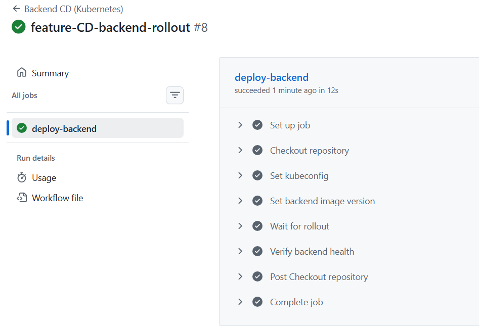
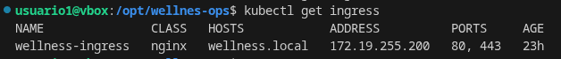
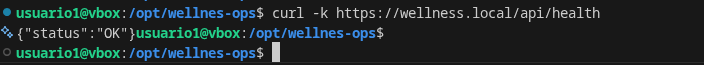

# 🧭 What is this?

[](https://github.com/luisrodvilladaorg/wellnes-ops/actions/workflows/docker-backend-ci.yml)
[](https://github.com/luisrodvilladaorg/wellnes-ops/actions/workflows/docker-frontend-ci.yml)
[](https://github.com/luisrodvilladaorg/wellnes-ops/commits/main)
[](https://github.com/luisrodvilladaorg/wellnes-ops/actions/workflows/docker-nginx-ci.yml)
[](https://github.com/luisrodvilladaorg/wellnes-ops/actions/workflows/docker-stack-ci.yml)
[](https://github.com/luisrodvilladaorg/wellnes-ops/actions/workflows/kubernetes-backend-image-ci.yml)
[](https://github.com/luisrodvilladaorg/wellnes-ops/actions/workflows/kubernetes-frontend-ci.yml)
[](https://github.com/luisrodvilladaorg/wellnes-ops/actions/workflows/kubernetes-frontend-cd.yml)
[](https://github.com/luisrodvilladaorg/wellnes-ops/actions/workflows/nginx-gateway-cd.yml)
[](https://github.com/luisrodvilladaorg/wellnes-ops/actions/workflows/docker-stack-cd.yml)
[](https://github.com/luisrodvilladaorg/wellnes-ops/actions/workflows/docker-stack-down-prod.yml)
[](https://github.com/luisrodvilladaorg/wellnes-ops/actions/workflows/docker-stack-rollback.yml)

This project is a fully containerized, production-ready DevOps environment designed to showcase modern infrastructure practices. It combines Docker, Kubernetes, GitHub Actions, NGINX, TLS, monitoring, and end-to-end CI/CD to demonstrate how a real-world application is built, deployed, and operated.

## Recruiter TL;DR

This repository demonstrates a production-style DevOps platform including:

- Dockerized microservices (frontend + backend + PostgreSQL)
- Kubernetes deployments with health checks and rolling updates
- CI/CD pipelines using GitHub Actions
- Security scanning with Trivy
- Monitoring stack with Prometheus and Grafana
- Infrastructure as Code with Terraform
- Self-hosted Kubernetes cluster with Ingress and TLS

The project simulates a real production deployment pipeline from commit to running services.

## ⚙️ What does it do?

The platform builds and deploys a Node.js backend, serves a static frontend through an NGINX gateway, routes traffic with an Ingress Controller, and exposes services securely over TLS. It also includes automated CI/CD pipelines, container image publishing, Kubernetes manifests, and a complete monitoring stack with Prometheus, Grafana (via Helm), and Alertmanager.

<p align="center">
  
</p>

---

## 🎯 Key Features

- ✅ Node.js backend with API routes and JWT authentication
- ✅ Static frontend (HTML/CSS/JS) served by NGINX
- ✅ PostgreSQL database
- ✅ Docker Compose for local development
- ✅ Kubernetes manifests for production orchestration
- ✅ CI/CD with GitHub Actions (build + publish)
- ✅ Monitoring with Prometheus metrics integration
- ✅ TLS certificates (Let's Encrypt in production, self-signed in development)
- ✅ MetalLB load balancing for bare-metal clusters
- ✅ NGINX as ingress and reverse proxy

---

## 📐 Architecture


---

## 🐳 Running Pods


---

## 📊 Monitoring


---

## 🔄 CI/CD Overview

The CI/CD setup automates service delivery to Kubernetes and production stack operations.

- Build, test, and validate services
- Publish versioned container images to GHCR
- Apply rolling updates with health verification
- Support production deploy, rollback, and shutdown workflows


---

## 🚀 Backend CI

Backend CI validates code quality and build readiness on pushes and pull requests.

- Run dependency installation and build checks
- Validate backend project structure
- Build backend container image for verification


---

## 📦 Continuous Delivery

Delivery pipelines automate image publication and deployment actions.

- Push images to GHCR
- Update deployment image references
- Validate rollout and post-deploy health



---

## 📈 Pipeline Visibility

Track workflow execution with logs and historical runs directly in GitHub Actions.


---

## 📉 Prometheus

Prometheus collects backend metrics in real time and stores time-series data for analysis.


---

## 📊 Grafana

Grafana provides dashboards and visualization for Prometheus data (installed via Helm).


---

## 📌 Key Metrics

- Latency ($p50$, $p95$, $p99$)
- Requests per second (RPS)
- Error rates ($5xx$, $4xx$)
- CPU and memory consumption
- Database connectivity status


---

## 🌍 Environments

The project supports two fully configured environments.

### 🖥️ Development Environment

- Docker Compose for fast local iteration
- Hot reload for frontend/backend changes
- Local PostgreSQL container
- Self-signed certificates

```shell
docker compose -f docker-compose.dev.yml up -d
```

### 🏢 Production Environment

- Kubernetes rolling deployments
- TLS with cert-manager + ACME
- Prometheus + Grafana + Alertmanager monitoring
- Automated CI/CD with GitHub Actions

```shell
kubectl apply -R -f k8s/
```

### 📊 Environment Comparison

| Area | Development | Production |
|------|-------------|------------|
| Orchestration | Docker Compose | Kubernetes |
| Persistence | Local volumes | StatefulSets + PVC |
| TLS/HTTPS | Self-signed | Let's Encrypt |
| Scalability | Manual | Horizontal scaling |

---

## 🧱 Network & Traffic Flow

Traffic enters through MetalLB and NGINX Ingress, then routes to frontend or backend services based on path rules.

- `/api/*` → Backend service (ClusterIP:3000)
- `/*` → Frontend service (ClusterIP:80)

Backend is the only component allowed to access PostgreSQL, providing network-level isolation.

---

## 📎 External Access

### 1) Ingress Controller Service

Ingress exposes ports `80` and `443` to receive external traffic.

### 2) Ingress with External IP



### 3) TLS Validation


### 4) API Request Validation



---

## 📥 Installation

Clone the repository:

```bash
git clone https://github.com/luisrodvilladaorg/wellnes-ops.git
cd wellnes-ops
```

Configure environment variables (based on your `.env` strategy).

Start the development stack:

```bash
docker compose -f docker-compose.dev.yml up -d
```

Check backend logs:

```bash
docker logs wellness-backend-container
```

---

## ☸️ Kubernetes (Production-style mode)

Apply Kubernetes resources:

```bash
kubectl apply -R -f k8s/
```

For advanced ingress and TLS setup, follow the documentation in `docs/`.

---

## 📚 Additional Resources

- Kubernetes and Docker guide: [docs/kubernetes-guide.pdf](docs/kubernetes-guide.pdf)
- HTTPS notes: [HTTPS.md](HTTPS.md)

---

## 📄 License

This project is distributed under the license defined in [LICENSE](LICENSE).

---

## 👤 Author

Luis Fernando Rodríguez Villada

luisfernando198912@gmail.com
