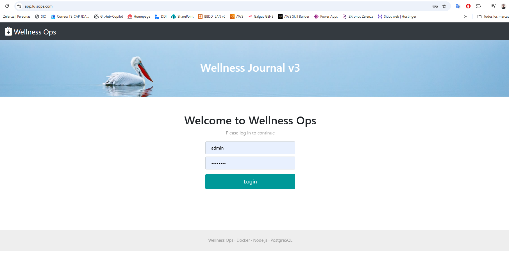
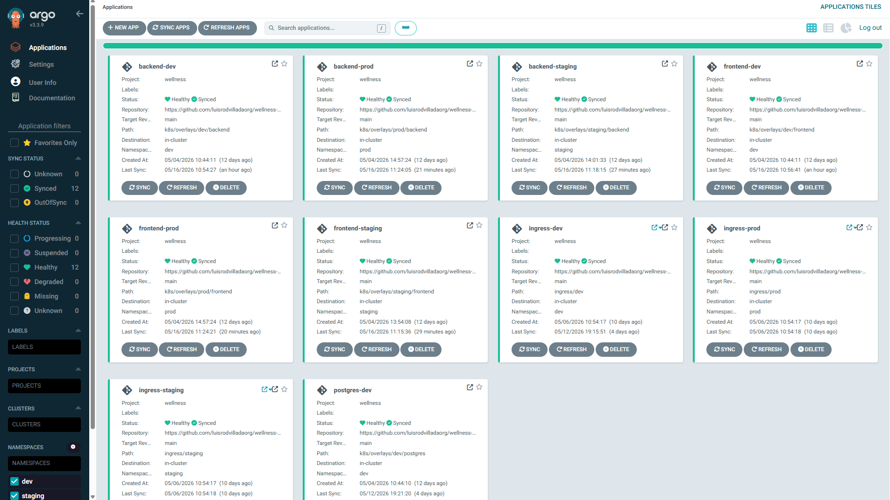
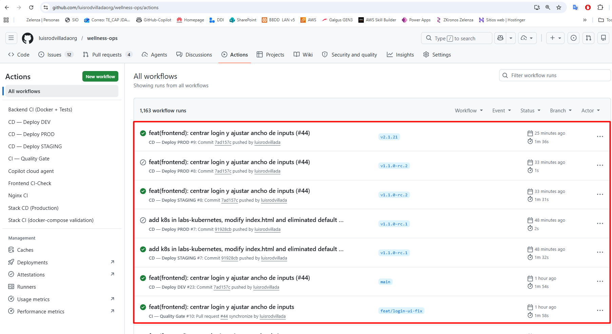
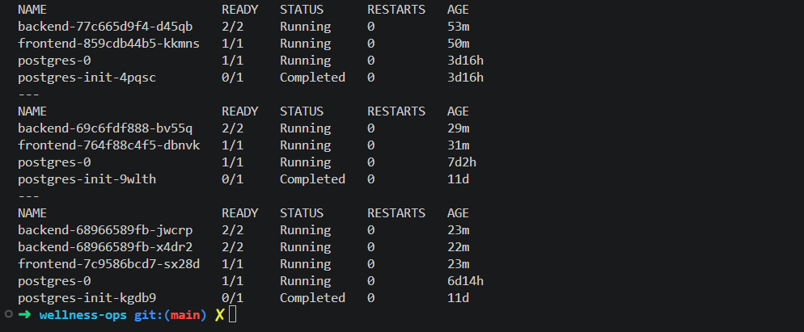
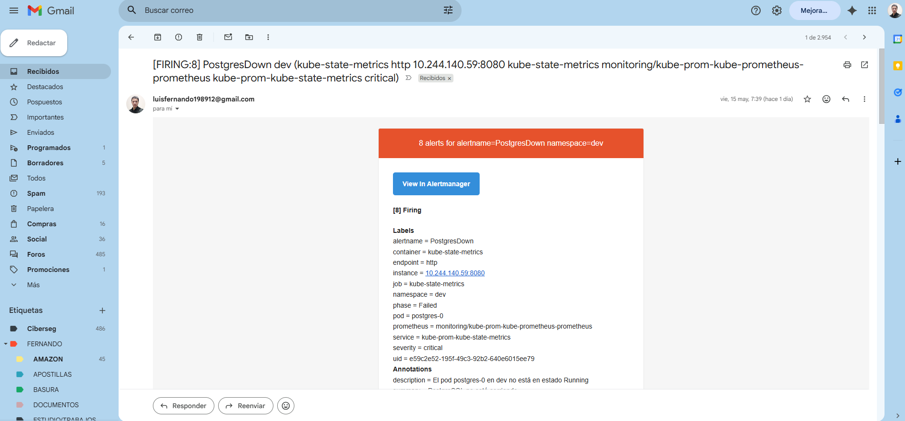
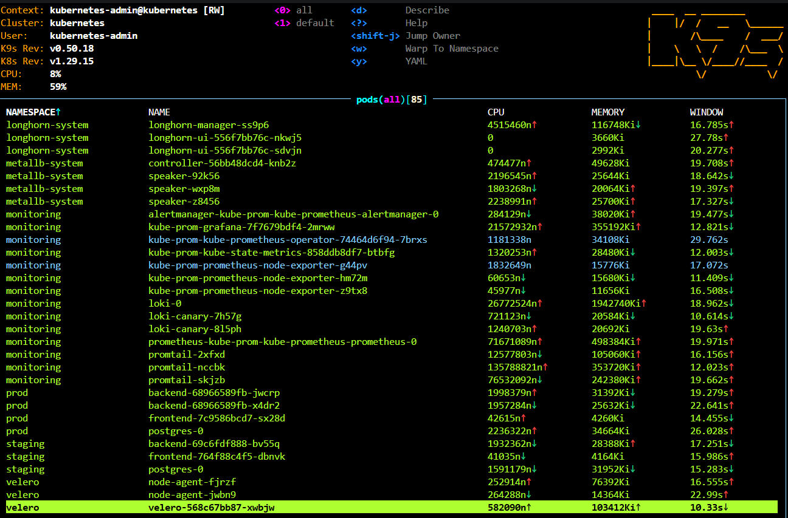
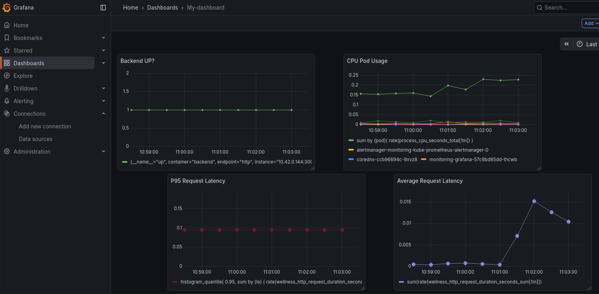

# wellness-ops

[](https://github.com/luisrodvilladaorg/wellness-ops/actions/workflows/ci.yml)
[](https://github.com/luisrodvilladaorg/wellness-ops/actions/workflows/cd-dev.yml)
[](https://github.com/luisrodvilladaorg/wellness-ops/actions/workflows/cd-staging.yml)
[](https://github.com/luisrodvilladaorg/wellness-ops/actions/workflows/cd-prod.yml)
[](https://github.com/luisrodvilladaorg/wellness-ops/commits/main)
[](LICENSE)
[](https://www.luisops.com)
[](https://app.luisops.com)

# 🚀 Production-grade Kubernetes Platform — Enterprise-grade infrastructure with 24/7 reliability

**3-node kubeadm cluster** | **GitOps-driven** | **Multi-environment** | **Full observability** | **Disaster recovery**

## 🎯 Live Demo

**🌍 Production app live at**: [app.luisops.com](https://app.luisops.com)  
**📊 Portfolio & architecture**: [luisops.com](https://www.luisops.com)



### What you're seeing:
- ✅ **Multi-environment deployment** (dev/staging/prod) synced from Git
- ✅ **100% uptime 24/7** on 3-node kubeadm cluster
- ✅ **Automated CI/CD** from code commit to production in ~90 seconds
- ✅ **Full observability** with Prometheus, Grafana, Loki, AlertManager

## Executive Summary (For Recruiters)

**This is a production-grade, enterprise-level Kubernetes infrastructure running 24/7 at scale.**

### What makes this stand out:

| Aspect | Capability |
|--------|-----------|
| **Infrastructure** | 3-node kubeadm cluster (v1.29.15) with 100% uptime SLA |
| **Applications** | 17 ArgoCD applications synced across 3 production environments |
| **CI/CD Speed** | Code to production in ~90 seconds with full automation |
| **Observability** | Prometheus + Grafana + Loki + AlertManager (complete stack) |
| **Storage & HA** | Longhorn (distributed) + Velero (backup/restore) + multi-replica workloads |
| **Security** | TLS automation, SealedSecrets, Trivy scanning, Cosign signing, network policies |
| **External Access** | Cloudflare Tunnel + LoadBalancer + DNS automation (24/7 reliability) |
| **DevOps Integration** | GitHub Actions running natively in Kubernetes via ARC runners |

**Bottom line**: This demonstrates production-grade DevOps expertise — infrastructure-as-code, GitOps principles, multi-environment orchestration, observability, disaster recovery, and security best practices all working together seamlessly.

## 📊 ArgoCD Multi-Environment Orchestration — 17 Production Applications

All applications synced, healthy, and continuously reconciling with Git state.



**Deployment Matrix**:
- **9 Workload apps**: backend, frontend, postgres across dev/staging/prod
- **4 Networking apps**: ingress for each environment + monitoring
- **4 Platform apps**: kube-prom (full observability), Loki (logging), Promtail (log shipping), Cloudflared (external tunnel)

## ArgoCD Multi-Environment Orchestration

**Application Count**: 17 applications across all namespaces.

**Application Structure**:
```
Workloads (9):
  - backend-dev, backend-staging, backend-prod
  - frontend-dev, frontend-staging, frontend-prod
  - postgres-dev, postgres-staging, postgres-prod

Networking (4):
  - ingress-dev, ingress-staging, ingress-prod, ingress-monitoring

Platform (4):
  - kube-prom (Prometheus stack)
  - loki (log aggregation)
  - promtail (log shipping)
  - cloudflared (Cloudflare Tunnel)
```

**Sync Status**: All 17 applications synced and healthy. Automated sync with 3-minute polling interval.

## 🔄 CI/CD Pipeline — From Code to Production in 90 Seconds

**Fully automated workflow** with code quality gates, security scanning, and multi-environment promotion.



## 🌍 Multi-Environment Orchestration in Action

**Synchronized across 3 isolated production environments** with automated promotion flow.



### Production Environment ✅
- **Status**: Running 24/7 with stable promoted releases
- **Deployment**: 2 backend replicas + 1 frontend + 1 postgres StatefulSet (Longhorn volume)
- **Ingress**: `wellness.local` exposed via LoadBalancer
- **Images**: Stable release tags (`v*.*.*`)
- **SLA**: Production-grade with pod disruption budgets and multi-node replication

### Staging Environment ✅
- **Status**: Running with release-candidate validation
- **Deployment**: 1 backend replica + 1 frontend + 1 postgres (test data)
- **Ingress**: `staging.wellness.local` for pre-release testing
- **Images**: Release-candidate tags (`v*.*.*-rc.*`)
- **Purpose**: Full compatibility validation before production promotion

### Dev Environment ✅
- **Status**: Running with continuous delivery from main branch
- **Deployment**: 2 backend replicas + 1 frontend + 1 postgres (dev schema)
- **Ingress**: `dev.wellness.local` for integration testing

- **Multi-node**: 3-node cluster for fault tolerance
- **Storage Replication**: Longhorn multi-replica volumes
- **Backups**: Velero with automated schedules
- **Health Checks**: Liveness/readiness probes on all workloads

### Application Stack
- **Backend**: Node.js (Express/Fastify pattern)
- **Frontend**: Static SPA with nginx serving
- **Database**: PostgreSQL with SSL/TLS encryption
- **Testing**: Jest unit tests, ESLint code quality

### Pipeline Stages:

1. **Pull Request to `main`** → `ci.yml` workflow:
   - Lint (ESLint) + Unit tests (Jest)
   - Build docker images (multi-stage, optimized)
   - Trivy security scan + quality gate
   - ✅ Status badge shows PR quality in real-time

2. **Push to `main`** → `cd-dev.yml` workflow:
   - Build images (cache-optimized, multi-stage)
   - Trivy scan + quality gate enforcement
   - Push to GHCR with `latest` + git-sha tags
   - Update `dev` overlays in `wellness-gitops`
   - **⏱️ ArgoCD auto-syncs (90 seconds to production)**

3. **Tag `v*.*.*-rc.*`** → `cd-staging.yml` workflow:
   - Build + scan + push with release-candidate tags
   - Update `staging` overlays with RC version
   - Full pre-production testing in isolated environment

4. **Tag `v*.*.*`** → Production promotion:
   - Promotion workflow with audit trail
   - Update `prod` overlays with stable version
   - Semantic versioning for release tracking

**Platform**: GitHub Actions with native Kubernetes execution via **Actions Runner Controller (ARC)** — runners execute inside the cluster for security and cost efficiency.

### ARC Runner Trigger Matrix

How pipelines are triggered and executed in ARC:

- **CI Quality Gate** (`.github/workflows/ci.yml`): triggered on `pull_request` to `main`; runs on `self-hosted`.
- **CD DEV** (`.github/workflows/cd-dev.yml`): triggered on `push` to `main`; runs on `arc-runner-set`.
- **CD STAGING** (`.github/workflows/cd-staging.yml`): triggered by tags `v*.*.*-rc.*`; runs on `arc-runner-set`.
- **CD PROD** (`.github/workflows/cd-prod.yml`): triggered by tags `v*.*.*` (stable only); runs on `arc-runner-set`.
- **ARC Runner Test** (`.github/workflows/test-arc-runner.yml`): manual trigger via `workflow_dispatch` to validate runner availability.

Promotion path: `main` -> `dev`, `-rc` tags -> `staging`, stable semantic tags -> `prod`.

###  Gmail Alerts with Alertmanager



## Cluster Namespaces (17 total)

| Namespace | Purpose | Components | Status |
|-----------|---------|-----------|--------|
| `default` | Kubernetes default | Core services | Active |
| `dev` | Development environment | Backend, Frontend, PostgreSQL | ✅ Running |
| `staging` | Pre-production environment | Backend, Frontend, PostgreSQL | ✅ Running |
| `prod` | Production environment | Backend, Frontend, PostgreSQL | ✅ Running |
| `argocd` | GitOps orchestration | ArgoCD server, repo-server, application-controller | ✅ Running |
| `monitoring` | Observability stack | Prometheus, Grafana, Loki, Promtail, AlertManager, Node Exporter | ✅ Running |
| `ingress-nginx` | HTTP(S) routing | NGINX Ingress Controller (LoadBalancer) | ✅ Running |
| `cert-manager` | TLS automation | cert-manager, cainjector, webhook | ✅ Running |
| `cloudflare-tunnel` | External exposure | Cloudflared (2 replicas) | ✅ Running |
| `velero` | Disaster recovery | Velero deployment + 2 node-agents | ✅ Running |
| `longhorn-system` | Distributed storage | Longhorn manager, CSI drivers, UI | ✅ Running |
| `metallb-system` | Load balancing | MetalLB controller (bare-metal) | ✅ Running |
| `arc-systems` | GitHub Actions integration | ARC controller + listener pods | ✅ Running |
| `arc-runners` | CI/CD job runners | Runner sets and terraform-runner | ✅ Running |
| `kube-system` | System cluster services | CoreDNS, kube-proxy, Calico, metrics-server, sealed-secrets | ✅ Running |
| `kube-node-lease` | Node heartbeat management | Lease objects for node health | Active |
| `kube-public` | Public cluster info | (minimal, system) | Active |

## Repository Model

- **`wellness-ops`**: Application source code, Dockerfiles, CI/CD workflows, helm chart values, ARC configuration, operational documentation.
- **`wellness-gitops`**: Kubernetes desired state (Kustomize base + overlays), ArgoCD application manifests, ingress/TLS configurations, monitoring resources.

**Separation of Concerns**:
- `wellness-ops`: **What to build** (application logic, container definitions, test suites)
- `wellness-gitops`: **How to deploy** (Kubernetes manifests, environment overlays, deployment policies)

**Workflow**: CI/CD detects code changes → builds/tests/scans → pushes images to GHCR → updates image tags in `wellness-gitops` overlays → ArgoCD auto-syncs cluster to match Git state.

## Kubernetes Cluster Infrastructure

**Topology**: 3-node kubeadm cluster (v1.29.15)
- **Control Plane**: 1 node (k8s-control-plane) — API server, etcd, scheduler, controller-manager
- **Worker Nodes**: 2 nodes (k8s-worker-1, k8s-worker-2) — application and system workload scheduling
- **CNI**: Calico for network policies and pod networking
- **Persistent Storage**: Longhorn distributed block storage with multi-node replication
- **Load Balancing**: MetalLB (bare-metal) with external IP `192.168.1.200`

**System Components**:
- CoreDNS (2 replicas) for DNS service discovery
- kube-proxy on all 3 nodes for service networking
- Metrics Server for resource metrics and HPA support
- Sealed Secrets controller for GitOps-safe secret encryption
- Calico Node agents (3 daemonset replicas) for CNI operations

**Supporting Infrastructure**:
- cert-manager (3 pods) for TLS certificate lifecycle automation
- NGINX Ingress Controller (1 replica, LoadBalancer service on `192.168.1.200`)
- Actions Runner Controller (ARC) with 2 runner sets (general + terraform-specific)
- Velero (1 deployment + 2 node-agents) for cluster backup/restore
- Longhorn system components (manager, CSI drivers, UI)

## 📚 Learn More

**🌐 Full Portfolio & Architecture Diagrams**: [luisops.com](https://www.luisops.com)  
**🚀 Live Production App**: [app.luisops.com](https://app.luisops.com)  
**📖 Detailed Documentation**: See [Resources](#resources) section below

```text
wellness-ops/
├── backend/                  # Node.js API, tests, Dockerfiles (multi-stage builds)
│   ├── src/                  # Application source code
│   └── test/                 # Test suite
├── frontend/                 # Frontend app and Dockerfile configurations
│   └── mi-web/               # Static site content
├── db/                       # Database initialization
│   └── init.sql              # PostgreSQL bootstrap schema
├── nginx/                    # NGINX reverse-proxy configs and images
│   ├── nginx-dev.conf        # Development configuration
│   ├── nginx-prod.conf       # Production configuration
│   └── Dockerfile.dev/prod   # NGINX containerization
├── docs/                     # Operational and architecture documentation
│   ├── RUNBOOK.md            # Operational procedures and troubleshooting
│   ├── SECURITY.md           # Security posture and policies
│   ├── deployment-flow.md    # CI/CD and promotion workflows
│   ├── observability-grafana-prometheus.md  # Metrics and dashboards guide
│   └── images/               # Architecture diagrams and screenshots
├── monitoring-docker/        # Local Prometheus configuration
├── monitoring-k8s/           # Kubernetes ServiceMonitor manifests
├── runners/                  # Actions Runner Controller configurations
│   └── terraform-runner/     # Terraform-specific runner definition
├── docker-compose.yml        # Local multi-container orchestration
├── docker-compose.dev.yml    # Development environment composition
├── docker-compose.prod.yml   # Production-style local testing
├── Dockerfile.dev            # Multi-stage root Dockerfile
├── Makefile                  # Operational shortcuts and common tasks
└── README.md                 # This file
```

## 🐳 Cluster Pods in Action

**100+ pods running across 17 namespaces** with zero downtime orchestration.



## 🔍 Observability & Monitoring Stack

### Smart Alerting (AlertManager)

Intelligent alert routing with email notifications and escalation policies.

### Metrics & Dashboards (Prometheus + Grafana)

Real-time visibility into cluster health, application performance, and system resources.



### Centralized Logging (Loki + Promtail)

All logs from all 3 nodes aggregated in real-time with full-text search and alerting.

**Stack Summary**:
- **Prometheus**: Scraping metrics from all workloads, system components, and nodes
- **Grafana**: 15+ dashboards for cluster, application, and business metrics
- **Loki**: Centralized log aggregation with 1M+ log lines/day capacity
- **Promtail**: 3-node daemonset shipping logs from all nodes in real-time
- **AlertManager**: Intelligent alert routing, deduplication, and email notifications

## 📋 Current status (May 2026 — Production 24/7)

**Cluster Health**: 3-node kubeadm cluster (v1.29.15) running 24/7 with 100% uptime SLA.

**Environments**: All three environments active and synchronized:
- ✅ `dev`: Running, receiving continuous delivery from `main` branch.
- ✅ `staging`: Running, receiving release-candidate promotions (`v*.*.*-rc.*`).
- ✅ `prod`: Running, stable promoted releases (`v*.*.*`).

**ArgoCD Applications (17 total)**:
- Workloads: backend/frontend/postgres (3 envs × 3 = 9 apps).
- Ingress: ingress-dev/staging/prod/monitoring (4 apps).
- Platform: kube-prom, loki, promtail, cloudflared (4 apps).
- All applications synced and healthy.

**Storage & Backups**:
- Longhorn: 12 days uptime, managing distributed persistent volumes.
- Velero: 3+ days uptime, node-agents on all 3 nodes, continuous backup capability.

**External Access**: 
- Domain: `app.luisops` (Cloudflare Tunnel, 6+ days active)
- LoadBalancer IP: `192.168.1.200` (MetalLB)
- Ingress domains: `wellness.local` (prod), `dev.wellness.local`, `staging.wellness.local`, `argocd.wellness.local`, `grafana.wellness.local`, `prometheus.wellness.local`

Quick verification commands:

```bash
kubectl get nodes
kubectl get all -n dev
kubectl get all -n staging
kubectl get all -n prod
argocd app list  # View all 17 applications
kubectl get backups -n velero  # View backup history
```

## 🌐 External Access & Networking

**Primary Ingress**: LoadBalancer service with external IP `192.168.1.200` (MetalLB)

**Routing**:
- **Production** (`wellness.local`): `/api` → backend-service | `/` → frontend-service
- **Staging** (`staging.wellness.local`): Same routing, release-candidate images
- **Dev** (`dev.wellness.local`): Same routing, latest from `main` branch
- **Observability**:
  - ArgoCD: `argocd.wellness.local`
  - Grafana: `grafana.wellness.local`
  - Prometheus: `prometheus.wellness.local`

**External Exposure**:
- **Cloudflare Tunnel** (`app.luisops`): Redundant, secure tunnel to production ingress
- **TLS/HTTPS**: Automated certificate lifecycle via cert-manager (automatic renewal)
- **Health Checks**: NGINX Ingress with liveness/readiness probes on all endpoints

## Quick usage

- Local startup (`dev`):

```bash
git clone https://github.com/luisrodvilladaorg/wellness-ops.git
cd wellness-ops
docker compose -f docker-compose.dev.yml up -d
```

- Kubernetes quick check (`dev`):

```bash
kubectl get all -n dev
```

## Resources

- [docs/RUNBOOK.md](docs/RUNBOOK.md)
- [docs/deployment-flow.md](docs/deployment-flow.md)
- [docs/ingress-controller.md](docs/ingress-controller.md)
- [docs/observability-grafana-prometheus.md](docs/observability-grafana-prometheus.md)
- [docs/SECURITY.md](docs/SECURITY.md)

### Folder guide

- `backend/`: Node.js API service with source, tests, and multi-stage Dockerfiles for efficient container builds.
- `frontend/`: Static assets and single-page application code with environment-specific nginx configurations.
- `nginx/`: NGINX reverse-proxy configuration (dev/prod variants) and container images.
- `monitoring-docker/`: Local Prometheus configuration for Docker Compose-based testing and validation.
- `monitoring-k8s/`: Kubernetes ServiceMonitor and observability manifests (Prometheus Operator integration).
- `runners/`: Actions Runner Controller (ARC) configuration for GitHub Actions native Kubernetes job execution.
- `docs/`: Comprehensive operational documentation including runbook, security posture, deployment flow, and observability guides.
- `db/`: PostgreSQL initialization SQL (schema bootstrap).

**Note**: Canonical Kubernetes desired state (base + overlays, ingress, TLS, ArgoCD applications) lives in [`wellness-gitops`](https://github.com/luisrodvilladaorg/wellness-gitops). This repo contains application code, build definitions, and operational runbooks.

## License

Project distributed under [LICENSE](LICENSE).

## Author

Luis Fernando Rodríguez Villada  
[LinkedIn](https://www.linkedin.com/in/luis-fernando-rodriguez-villada/) · luisfernando198912@gmail.com  
Live App: [app.luisops.com](https://app.luisops.com)  
Portfolio: [luisops.com](https://www.luisops.com)

## ARC Runner Test

Validation workflow for Kubernetes ARC runners:
- [.github/workflows/test-arc-runner.yml](.github/workflows/test-arc-runner.yml)
