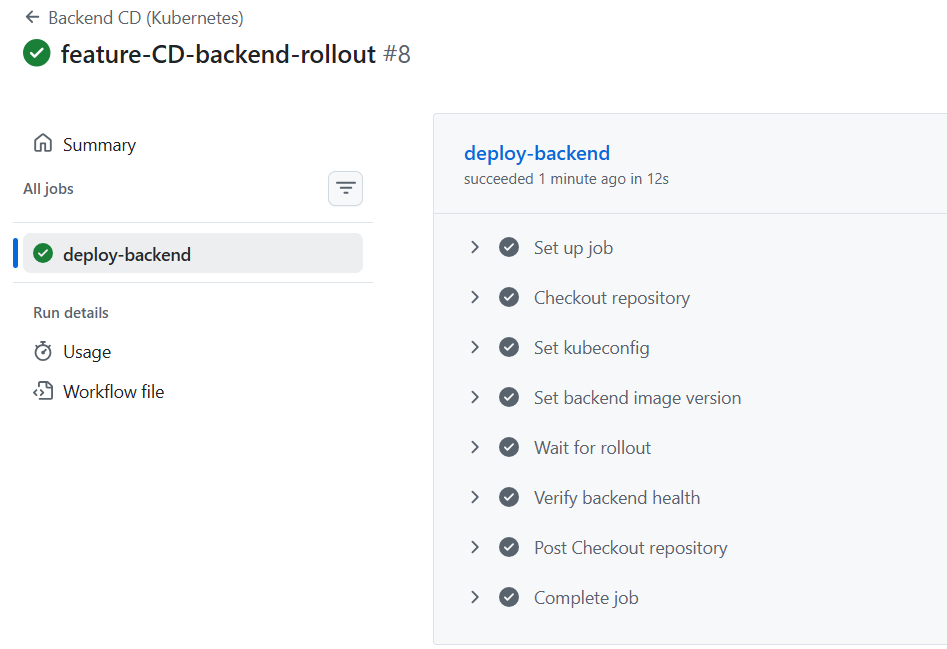

# 🧭 ¿Qué es esto?

Este proyecto es un entorno DevOps completamente containerizado y listo para producción, diseñado para demostrar prácticas modernas de infraestructura. Reúne Docker, Kubernetes, GitHub Actions, NGINX, TLS, monitoreo y un pipeline CI/CD completo para mostrar cómo una aplicación del mundo real se construye, se despliega y se opera de manera integral.

## ⚙️ ¿Qué hace?

Este sistema construye y despliega un backend en Node.js, sirve un frontend estático a través de una puerta de enlace NGINX, gestiona el tráfico utilizando un Ingress Controller y expone la aplicación de forma segura a través de TLS. También incluye pipelines de CI/CD automatizados, publicación de imágenes de contenedor, manifiestos de Kubernetes y una pila completa de monitoreo con Prometheus y Grafana.

 <p align="center">
  
</p>

---

## 📐 Arquitectura


## 🐳 Pods en ejecución


## 📊 Monitoreo


## 🔄 CI/CD - Integración Continua


## 🚀 Integración Continua - Backend


## 📦 Despliegue/Entrega Continua



## 📈 Pipelines


## 📉 Prometheus


## 📊 Grafana


## 📌 Métricas


---

## 📚 Documentación

Para capturas de pantalla adicionales relacionadas con el proyecto y su ejecución, visite el siguiente enlace: [Guía de Kubernetes y Docker - wellness ops](docs/kubernetes-guia.pdf).


## Installation

To install the project on your host, use the following command which will make a copy of the entire repository from Git.

*Prerequisites

- Docker >= 24
- Docker Compose
- Kubernetes (k3d/kind/minikube)
- kubectl
- Helm

   
* MacOS or Linux

   ```shell
   git clone https://github.com/luisrodvilladaorg/wellnes-ops.git
   cd wellnes-ops
   ```

* Create environment variables necessary for project use (see example file .env.example). For security reasons, we do not include public environment variables. 

  Edit the `.env` file if needed

* Start the stack with Docker Compose (development environment) in the background

  ```shell
  docker compose -f docker-compose.dev.yml up -d
  docker ps
  ```

* Verify that the backend is working

  ```shell
  docker logs wellness-backend-container
  ```

* Exposes the backend’s internal port 3000 to the host

  ```shell
  docker run -d -p 3000:3000 --name wellness-backend wellnes-ops-backend
  ```

* functional tests

  ```shell
  curl http://localhost:3000/api/health
  ```


## Kubernetes (PRODUCTION / REAL mode)

* Create cluster

  ```shell
  k3d cluster create cluster-wellness-local
  ```

* apply manifests

  ```shell
  kubectl apply -R -f k8s/
  ```

* Check status

  ```shell
  kubectl get pods
  kubectl get svc
  kubectl get ingress
  ```
* Access the application

  ```shell
  curl -k https://wellness.local/api/health

  ```
Please update your `/etc/hosts` file by adding the following entry:

127.0.0.1   wellness.local


The project can be run locally using Docker Compose for development or deployed to Kubernetes for a production-like environment.

To continue with the next, more advanced steps on installing the nginx ingress controller and TLS certificates, please go to the file located in /docs/guide


---

## Diferent layers

                          ┌───────────────────────┐
                          │        Client         │
                          │   Browser / Curl      │
                          └───────────┬───────────┘
                                      │
                               HTTPS (443)
                                      │
                    ┌─────────────────▼─────────────────┐
                    │        NGINX Ingress Controller     │
                    │      (TLS termination, routing)    │
                    └───────────┬───────────┬───────────┘
                                │           │
                           "/"  │           │  "/api/*"
                                │           │
          ┌─────────────────────▼───┐   ┌───▼─────────────────────┐
          │      nginx-gateway      │   │        Backend API        │
          │   (internal reverse     │   │   Node.js / Express      │
          │        proxy)           │   │   JWT · REST · Metrics   │
          └───────────┬─────────────┘   └───────────┬─────────────┘
                      │                               │
                 HTTP │                               │ SQL
                      │                               │
        ┌─────────────▼─────────────┐     ┌──────────▼──────────┐
        │          Frontend          │     │     PostgreSQL       │
        │     Static Web (Nginx)     │     │   StatefulSet + PVC  │
        └───────────────────────────┘     └─────────────────────┘

        ───────────────────────── Observability ─────────────────────────

                 ┌───────────────────┐     ┌───────────────────┐
                 │    Prometheus     │◄────│  Backend /metrics │
                 │  (ServiceMonitor) │     │   (internal only) │
                 └─────────┬─────────┘
                           │
                           ▼
                     ┌───────────────┐
                     │    Grafana    │
                     │ Dashboards    │
                     └───────────────┘

        ───────────────────────── CI / CD ─────────────────────────

        ┌──────────────┐   build & push   ┌────────────────────────┐
        │   GitHub     │ ───────────────► │   GHCR (Docker Images) │
        │   Actions    │                  └───────────┬────────────┘
        └──────┬───────┘                              │
               │ deploy                                │ pull
               ▼                                       ▼
        ┌─────────────────────────────────────────────────────────┐
        │                    Kubernetes Cluster                   │
        │              (Rolling Updates & Rollback)               │
        └─────────────────────────────────────────────────────────┘

---


### Contributor

Luis Fernando Rodríguez Villada

luisfernando198912@gmail.com

https://luisops.com