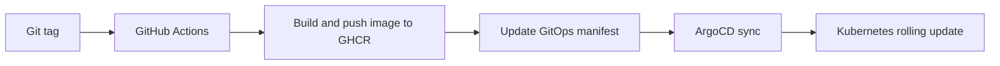

# 🚀 Backend deployment flow

Short version: this project shows a clean **GitOps release flow** from Git tag to Kubernetes deployment.

## ✨ At a glance

- **Source repo:** `wellnes-ops`
- **GitOps repo:** `wellness-gitops`
- **Registry:** GHCR
- **Delivery model:** GitHub Actions + ArgoCD
- **Release trigger:** semantic tag like `v2.1.15`

---

## 🧭 The flow in 5 steps

### 1. 🏷️ Tag a release

A tag such as `v2.1.15` triggers the workflow in [wellnes-ops/.github/workflows/kubernetes-build-push-images.yml](https://github.com/luisrodvilladaorg/wellnes-ops/blob/main/.github/workflows/kubernetes-build-push-images.yml).

### 2. 🏗️ Build and publish the backend image

GitHub Actions validates the backend, builds the production image, and publishes it to GHCR.

Example image:

- `ghcr.io/luisrodvilladaorg/wellness-ops-backend:v2.1.15`

### 3. 📝 Update the GitOps repository

The same pipeline updates the backend image tag in [wellness-gitops/backend/backend-deployment.yml](https://github.com/luisrodvilladaorg/wellness-gitops/blob/main/backend/backend-deployment.yml) and pushes that change to the GitOps repo.

### 4. 🔄 ArgoCD detects the new desired state

ArgoCD watches the GitOps repository, sees the new image version, and syncs the cluster to match Git.

> Note: the ArgoCD `Application` manifest is not present in this workspace, so this document describes the intended runtime setup already connected to `wellness-gitops`.

### 5. ☸️ Kubernetes rolls out the new version

Kubernetes performs a rolling update using the backend `Deployment`, which already includes:

- `replicas: 2`
- `RollingUpdate`
- `readinessProbe`
- `livenessProbe`

This keeps the rollout safer and more production-like.

---

## 🖼️ Release path

---

## 💼 Why it matters

- **Traceable releases:** tag, image, and deployment stay aligned.
- **Real GitOps:** Kubernetes state is updated through Git, not by hand.
- **Automation:** no manual image edits in the cluster.
- **Safer rollout:** probes and rolling updates reduce risk.

---

## 🔎 Quick proof points

- Workflow: [wellnes-ops/.github/workflows/kubernetes-build-push-images.yml](https://github.com/luisrodvilladaorg/wellnes-ops/blob/main/.github/workflows/kubernetes-build-push-images.yml)
- GitOps deployment: [wellness-gitops/backend/backend-deployment.yml](https://github.com/luisrodvilladaorg/wellness-gitops/blob/main/backend/backend-deployment.yml)
- GitOps structure: [wellness-gitops/backend](https://github.com/luisrodvilladaorg/wellness-gitops/tree/main/backend)

---

## ✅ One-line summary

**Git tag → GitHub Actions → GHCR image → GitOps update → ArgoCD sync → Kubernetes deployment**
