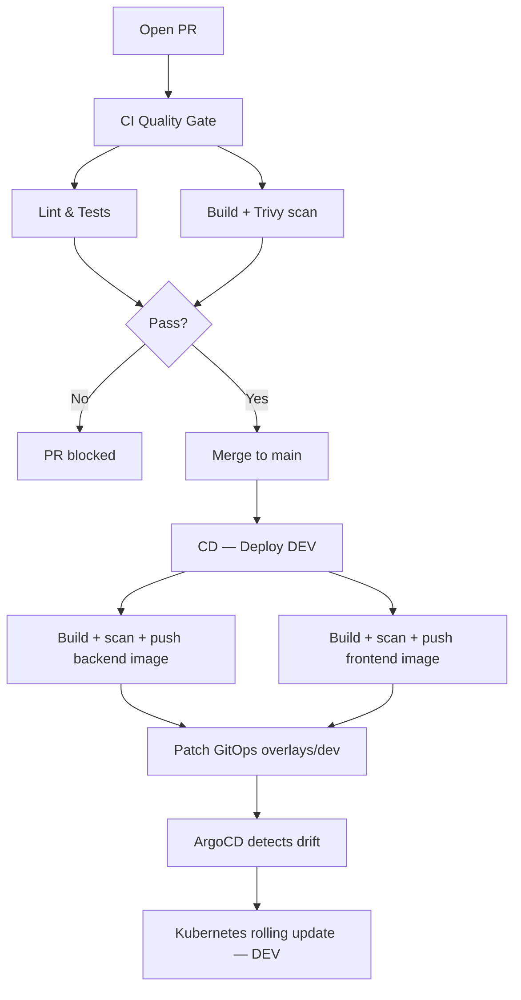

# Deployment flow

This project uses a two-pipeline GitOps model: a **CI Quality Gate** that protects `main`, and a **CD DEV** pipeline that deploys every merge automatically.

## At a glance

- **Source repo:** `wellness-ops`
- **GitOps repo:** `wellness-gitops`
- **Registry:** GHCR
- **Delivery model:** GitHub Actions + ArgoCD
- **CI trigger:** pull request targeting `main`
- **CD trigger:** push to `main` (merge)

---

## Pipelines

### CI — Quality Gate (`ci.yml`)

Runs on every **pull request to `main`**. Merge is blocked until this passes.

| Job | What it does |
|---|---|
| `lint-and-test` | `npm ci` → `npm run lint` → `npm test` |
| `build-and-scan` | Builds `backend/Dockerfile.prod`, runs Trivy (CRITICAL blocker), then discards the image |

The image built here is **never pushed** — its only purpose is to catch vulnerabilities before they reach the registry.

### CD — Deploy DEV (`cd-dev.yml`)

Runs on every **push to `main`** (i.e., after a PR merges). Tags images with the commit SHA.

| Job | What it does |
|---|---|
| `build-backend` | Builds + Trivy scan + pushes `wellness-ops-backend:<sha>` to GHCR |
| `build-frontend` | Builds + Trivy scan + pushes `wellness-ops-frontend:<sha>` to GHCR |
| `update-gitops-dev` | Patches `k8s/overlays/dev/backend/patch-image.yml` and `k8s/overlays/dev/frontend/patch-image.yml` in `wellness-gitops`, then commits and pushes |

ArgoCD watches `wellness-gitops` and syncs the DEV cluster automatically once the GitOps commit lands.

---

## Full flow

---

## Image naming

| Pipeline | Image tag | Example |
|---|---|---|
| CI (quality gate) | `ci-<sha>` — local only, deleted after scan | `wellness-ops-backend:ci-abc1234` |
| CD DEV | `<sha>` — pushed to GHCR | `wellness-ops-backend:abc1234` |

---

## Why it matters

- **Protected main:** no code lands without lint, tests, and a clean Trivy scan.
- **Continuous delivery to DEV:** every merge is live in the cluster within minutes, no manual steps.
- **Real GitOps:** the cluster state is driven by Git — ArgoCD never receives direct `kubectl apply` calls.
- **Traceable deployments:** SHA ties the running pod back to the exact commit.

---

## Quick proof points

- CI workflow: [.github/workflows/ci.yml](../.github/workflows/ci.yml)
- CD DEV workflow: [.github/workflows/cd-dev.yml](../.github/workflows/cd-dev.yml)
- GitOps DEV overlay: [wellness-gitops/k8s/overlays/dev](https://github.com/luisrodvilladaorg/wellness-gitops/tree/main/k8s/overlays/dev)

---

## One-line summary

**PR → CI Quality Gate → merge to main → CD DEV → GHCR images → GitOps patch → ArgoCD sync → Kubernetes DEV**
