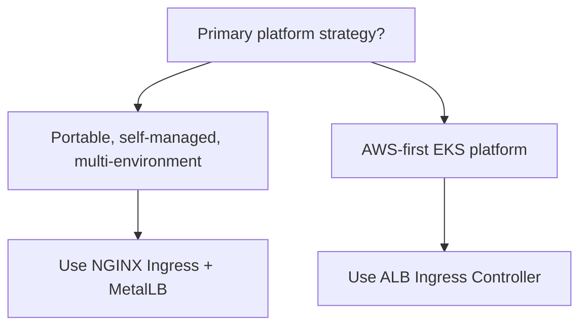

# 🚦 Ingress Controller: NGINX vs ALB

A concise overview of why this project uses **NGINX Ingress Controller** today, and when **AWS ALB Ingress Controller** is the stronger choice.

## ✨ Quick summary

### Why **NGINX Ingress Controller** is a strong fit here

- the current architecture prioritizes portability across self-managed and cloud environments,
- ingress is already defined with `ingressClassName: nginx` in [k8s/ingress/ingress-http.yml](../k8s/ingress/ingress-http.yml#L5-L8),
- **MetalLB** provides external IP exposure in non-managed Kubernetes platforms,
- domain-based routing is cleanly handled through `wellness.local`.

### When **ALB Ingress Controller** becomes the better choice

When the platform runs primarily on **AWS/EKS** and the team wants native integration with:

- **Application Load Balancer**,
- **ACM** certificates,
- **AWS WAF**,
- AWS-native networking and security controls.

---

## 🧭 What each option provides

### NGINX Ingress Controller

A controller that runs **inside the cluster** and evaluates `Ingress` rules to route HTTP/HTTPS traffic to services.

Best suited for:

- self-managed Kubernetes platforms,
- on-prem and bare-metal deployments,
- multi-environment architectures,
- teams that value portability and deep traffic control.

### ALB Ingress Controller

In AWS, it creates and manages a real **Application Load Balancer** from Kubernetes `Ingress` resources.

Best suited for:

- EKS-first platforms,
- organizations standardizing on AWS managed services,
- teams optimizing for cloud-native AWS integrations.

---

## ⚖️ Key differences

| Topic | NGINX Ingress Controller | ALB Ingress Controller |
|---|---|---|
| Runtime model | Runs in-cluster | Uses AWS-managed ALB |
| Best-fit environment | Self-managed, on-prem, bare metal, multi-cloud | AWS / EKS |
| Cloud dependency | Low | High |
| External exposure | `LoadBalancer`, NodePort, or MetalLB patterns | Native AWS ALB |
| TLS model | cert-manager + TLS secrets + flexible policy control | Tight ACM integration |
| Cost profile | Usually efficient outside managed LB ecosystems | Depends on AWS ALB usage patterns |
| Portability | High | Lower due to AWS coupling |
| HTTP customization | Very high with NGINX annotations/config | Strong, but bounded by ALB features |
| Strategic fit | Platform portability and engineering control | AWS-native operational optimization |

---

## 🏗️ How this applies to Wellness Ops

The current design is consistent and production-minded:

1. **NGINX Ingress** receives traffic for `wellness.local`.
2. **MetalLB** assigns externally reachable IP addresses in self-managed Kubernetes.
3. Ingress routes traffic to gateway/backend services.
4. TLS is managed with cluster-native manifests and cert-manager patterns.

Architecture references:

- host rule: [k8s/ingress/ingress-http.yml](../k8s/ingress/ingress-http.yml#L8)
- MetalLB config: [k8s/metallb/ip-pool.yml](../k8s/metallb/ip-pool.yml) and [k8s/metallb/12-advertisement.yml](../k8s/metallb/12-advertisement.yml)
- HTTPS notes: [HTTPS.md](../HTTPS.md)

---

## ✅ Why NGINX is a strategic advantage in this project

### 1. 🌍 Cross-environment portability

The ingress model is reusable across self-managed clusters and multiple infrastructure targets.

### 2. 🔧 High operational control

NGINX enables precise control over:

- routing behavior,
- rewrites,
- headers,
- TLS handling,
- HTTP-level policy.

### 3. 🧩 Platform independence

The architecture avoids hard lock-in to a single cloud load balancer implementation.

### 4. 💼 Stronger engineering portfolio signal

It demonstrates practical Kubernetes networking skills, infrastructure adaptability, and architecture decisions focused on portability and long-term scalability.

---

## ☁️ When ALB is the right evolution

ALB is a strong next step when Wellness Ops operates mainly on **AWS/EKS**.

In that case, ALB provides:

- native **ACM** certificate integration,
- native **AWS WAF** integration,
- managed AWS load-balancing operations,
- tighter alignment with AWS enterprise governance models.

In short:

- **NGINX** = stronger for portability and platform control.
- **ALB** = stronger for AWS-native optimization.

---

## 🖼️ Decision guide

---

## 💼 Final message

This project uses **NGINX Ingress Controller** as a deliberate architectural choice to maximize portability, control, and infrastructure flexibility.

It showcases:

- Kubernetes traffic management expertise,
- real ingress exposure design,
- integration with MetalLB for self-managed Kubernetes,
- engineering decisions aligned with scalable platform evolution.

If the platform transitions to an AWS-first operating model, **ALB Ingress Controller** is a natural and credible evolution path.
